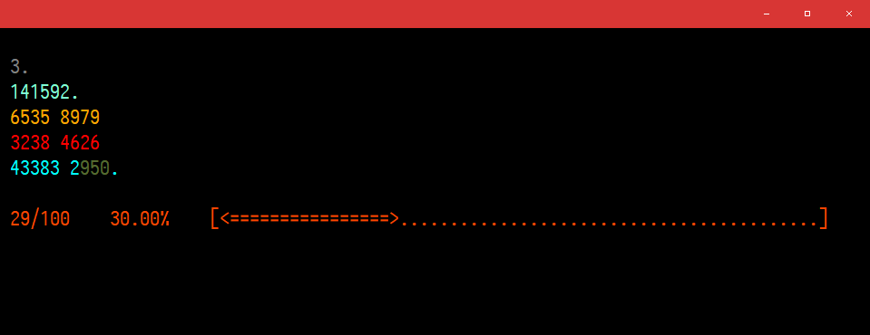

# MasterPI

A simple console app to help in learning Pi digits, whatever the purpopse may be.

## Features

* Configurable grouping of digits. (In data.json)
* Configurable color ID per group. (In data.json. Colors themselves must be set in `Configuration.cs`.)
* Set personal goal.
* Set default amount of digits for new non-configured groups.

Written in C#. (Quickly and badly)

